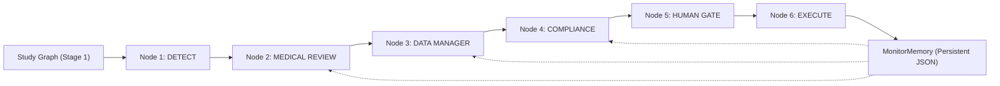

# ATLAS Stage 2 Architecture — MONITOR

## 1. System Overview
ATLAS Stage 2 is an autonomous, deterministic multi-agent clinical-trial review crew designed for continuous study monitoring. The system operates on real-time and cut-based clinical trial databases (`DM`, `AE`, `LB`, `VS`, `EX`, `CM`, `DS`, `MH`, `EG`), verifying safety, data quality, and protocol adherence against amended study protocols without requiring external LLM APIs.

The pipeline enforces strict temporal semantics, real-time audit tracing, duplicate suppression, and automated escalation management across trial cycles.



---

## 2. Six-Node Pipeline Architecture

The pipeline coordinator (`stage2.crew.ReviewCrew`) executes six specialized nodes in strict sequential order for every study cut:

### Node 1: DETECT (`stage2.nodes.detect.DetectNode`)
- **Input**: Current data cut (`cut: int`) and active protocol version (`protocol_version: int`).
- **Operation**: Queries Stage 1 `Atlas` and `StudyGraph` without modifying their public interface. Identifies:
  1. *Safety signals*: Potential Hy's Law cases (ALT/AST > 3×ULN + TBL > 2×ULN within 14 days), `AESHOSP=Y` with `AESER=N` (miscoded SAEs).
  2. *Data quality anomalies*: Pre-dose adverse events (`AESTDTC < RFSTDTC`), double enrollment duplicates, dosing discrepancies (`EXDOSE` vs protocol).
  3. *Protocol deviations*: Visit schedule window violations, prohibited concomitant medications, eligibility/screening threshold violations.
  4. *Site patterns*: Dosing clustering and implausible vital-sign regularity.
- **Output**: List of normalized `Finding` objects tagged with domain, record sequence, severity, and metadata.

### Node 2: MEDICAL REVIEW (`stage2.nodes.medical_review.MedicalReviewNode`)
- **Input**: List of detected findings and persistent `MonitorMemory`.
- **Clinical Evaluation**:
  - **Hospitalisation Serious Rule**: Any event with `AESHOSP=Y` and `AESER=N` is immediately upgraded to critical escalation `SAE_MISCODED`. Flags the mandatory 24-hour expedited reporting clock.
  - **Pre-existing Liver Baseline**: Checks screening ALT/AST. If baseline was already elevated (> 1.5×ULN), candidate is classified as `MONITORING_ONLY` with documented clinical rationale rather than an unwarranted safety escalation.
  - **Multi-Cycle Subject Flag**: Subjects flagged across $\ge 2$ consecutive cycles automatically trigger escalation `RECURRING_SUBJECT_SIGNAL`.
  - **Site Dosing Regularity**: Aggregated multi-subject dosing discrepancies at a site generate `IMPLAUSIBLE_SITE_PATTERN` escalations.
- **Output**: Tuple of `(escalation_drafts: List[EscalationDraft], monitoring_only: List[Dict])`.

### Node 3: DATA MANAGER (`stage2.nodes.data_manager.DataManagerNode`)
- **Input**: Data quality and compliance findings.
- **Operation**:
  - Generates clear, unambiguous, record-cited queries (domain, sequence number, subject ID, field name).
  - Checks `MonitorMemory.has_query(domain, usubjid, seq)`: if a query was previously raised for this record, it is suppressed.
  - Dispatches queries via `ReviewApiClient.post_query`. Sites confirm data or acknowledge updates.
- **Output**: List of new `Query` objects; duplicate count tracked in audit log.

### Node 4: COMPLIANCE (`stage2.nodes.compliance.ComplianceNode`)
- **Input**: Protocol findings, active protocol version, and memory.
- **Operation**:
  - Evaluates deviations against the protocol version in force:
    - *Protocol v1*: Standard visit window ($\pm 7$ days), prohibited medications (e.g. ketoconazole), screening inclusion criteria.
    - *Protocol v2*: Safety amendment adding renal exclusion (creatinine $> 1.5$ mg/dL).
    - *Protocol v3*: Window refinements ($\pm 3$ days) and expanded safety rules.
  - Clustered site deviations (e.g. Site S09 dosing errors across $\ge 3$ subjects) trigger site-level escalations.
  - Updates multi-cycle site flag tracking in memory.
- **Output**: Tuple of `(deviations: List[ProtocolDeviation], site_escalations: List[EscalationDraft])`.

### Node 5: HUMAN GATE (`stage2.nodes.human_gate.HumanGateNode`)
- **Input**: Combined escalation drafts (from Medical Review and Compliance).
- **Interactive Monitor Protocol**: Submits drafts to Medical Monitor API / decision ledger. Handles all three possible responses:
  1. **`APPROVED`**: Confirms escalation. Action items scheduled; status recorded as `APPROVED`.
  2. **`REJECTED`**: Monitor rejects escalation (e.g. social observation vs clinical admission). Finding is automatically downgraded to `MONITORING_ONLY`. Stored in memory to prevent re-escalation in any subsequent cycle.
  3. **`CLARIFY`**: Monitor requests additional context (e.g. *"What was the ALT at screening, and is there a concomitant hepatotoxic medication?"*).
     - Crew queries Stage 1 `StudyGraph` to answer the question using verified data (e.g. screening lab values, conmed records).
     - Crew appends `clarification_response` and automatically **resubmits**.
     - Monitor receives clarification and returns `APPROVED`.
- **Output**: List of resolved `EscalationDraft` objects.

### Node 6: EXECUTE (`stage2.nodes.execute.ExecuteNode`)
- **Input**: Aggregated results from Nodes 1–5.
- **Operation**:
  - Commits all new query keys, escalation keys, rejection records, and subject/site cycle counts to persistent storage.
  - Emits `execute` trace event summarizing cycle results.
  - Assembles the official `ReviewReport` object containing metrics, escalations, queries, deviations, site flags, monitoring items, and real-time execution trace.

---

## 3. Persistent Memory Architecture (`MonitorMemory`)

State persists across cycle executions and application restarts via `stage2_memory.json`:

| Storage Key | Data Structure | Purpose |
| :--- | :--- | :--- |
| `queries_raised` | `Set[Tuple[domain, usubjid, seq]]` | Guarantees ZERO duplicate queries on same data cut. |
| `escalations_made` | `Dict[code\|target_id, Record]` | Guarantees ZERO duplicate escalations on same data cut. |
| `rejected_escalations` | `Dict[code\|target_id, reason]` | Ensures rejected escalations remain monitoring-only indefinitely. |
| `subject_cycle_flags` | `Dict[usubjid, List[cut]]` | Tracks multi-cycle subject alerts; triggers escalation at count $\ge 2$. |
| `site_recurring_issues` | `Dict[site_id, List[cut]]` | Tracks recurring site non-compliance; flags site at count $\ge 2$. |
| `site_flags` | `Dict[site_id, Dict]` | Maintains current audit flags (e.g. `RECURRING_PROBLEMS`). |

---

## 4. Real-time Audit Trace
The crew generates a real-time event trace as decisions happen (not retrospectively). Every node logs structured `TraceEntry` records capturing the timestamp, node, action, human-readable message, and evidence citations:
```
detect          195 findings under protocol v2 - safety 6, data 28, compliance 160, site 1
medical_review  3 escalation drafts; 4 findings kept monitor-only (screening ALT already elevated)
data_manager    28 queries raised (28 confirmed by site, 0 unanswered); 0 duplicates prevented
compliance      178 deviations under v2: 144 visit windows, 7 prohibited medicines, 5 eligibility, 4 renal exclusion
human_gate      4 escalations await the medical monitor
human_gate      SAE_MISCODED 042-S02-004 -> APPROVED: Serious adverse event confirmed; expedited report within 24 h.
human_gate      HYS_LAW_CANDIDATE 042-S05-003 -> APPROVED: Consistent with Hy's law; report to safety.
execute         cycle complete: 195 findings, 4 escalations, 28 queries, 178 deviations
```

---

## 5. Protocol Amendments
Protocol changes (Version 1 $\to$ Version 2 $\to$ Version 3) alter the operational rules without changing the underlying raw data. When evaluated under Protocol v2, Node 1 and Node 4 dynamically load Protocol v2 rules from `documents/protocol_v2.md`:
- Creatinine exclusion $> 1.5$ mg/dL is enforced.
- Visit window rules adapt to amendment specifications.
- Prohibited medications list updates dynamically.
